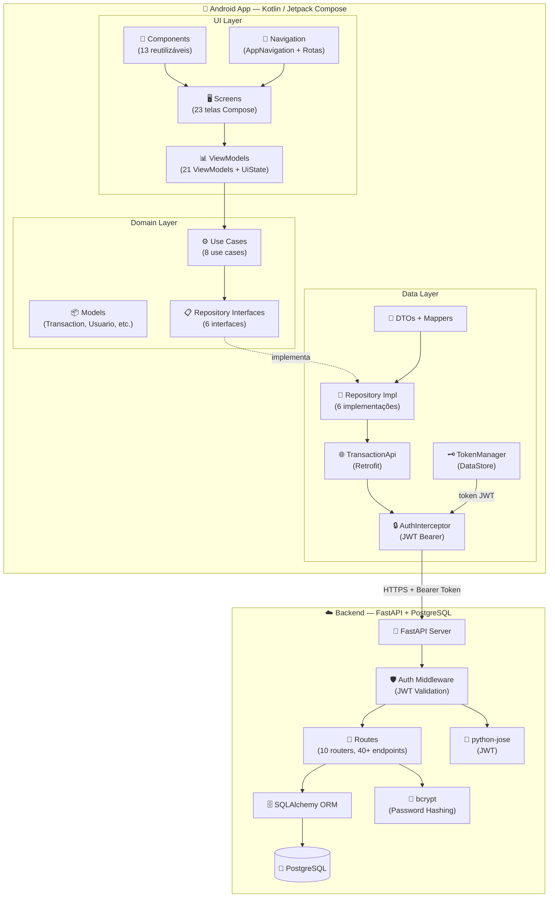
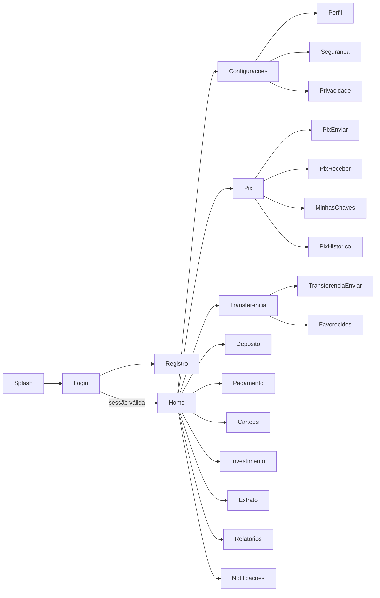
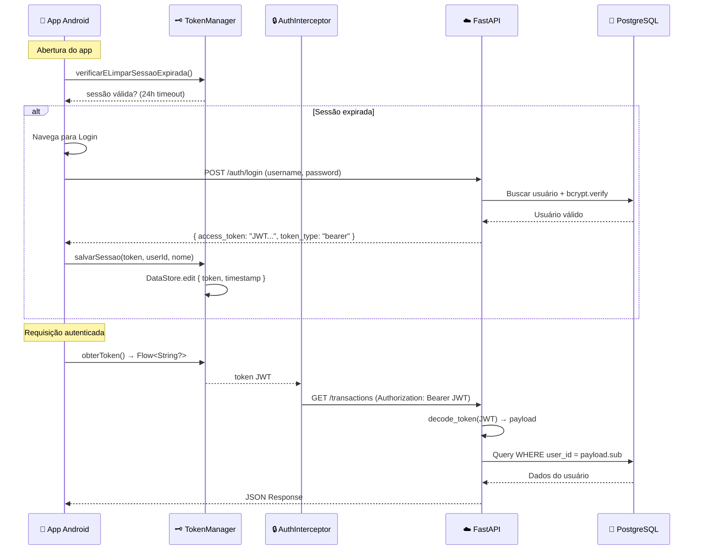

# 💰 IF Bank — Aplicação Mobile de Finanças

> **Projeto Final** da disciplina de **Desenvolvimento para Dispositivos Móveis II**
> integrada com **Projeto de Segurança da Informação**

Aplicação bancária completa desenvolvida em **Kotlin** com **Jetpack Compose**, consumindo uma **API REST própria** construída com **FastAPI + PostgreSQL**, com autenticação JWT, CRUD completo e mais de 20 telas.

---

## 📋 Índice

- [Visão Geral](#-visão-geral)
- [Tech Stack](#-tech-stack)
- [Arquitetura](#-arquitetura)
- [Diagrama de Arquitetura](#-diagrama-de-arquitetura)
- [Estrutura do Projeto](#-estrutura-do-projeto)
- [Funcionalidades](#-funcionalidades)
- [Telas do Aplicativo](#-telas-do-aplicativo)
- [API REST — Endpoints](#-api-rest--endpoints)
- [Requisitos Atendidos](#-requisitos-atendidos)
- [Recursos Extras Implementados](#-recursos-extras-implementados)
- [Como Executar](#-como-executar)

---

## 🎯 Visão Geral

O **IF Bank** é um aplicativo bancário digital completo que simula operações financeiras reais: transações, Pix, transferências bancárias, depósitos, pagamentos, cartões, investimentos, relatórios com gráficos e exportação de extrato em PDF.

| Item | Detalhe |
|------|---------|
| **Modalidade** | Opção 1 — Aplicação Integrada com API REST |
| **Tema** | Aplicativo bancário digital (fintech) |
| **Linguagem Mobile** | Kotlin |
| **Framework UI** | Jetpack Compose (Material 3) |
| **Backend** | FastAPI (Python) + PostgreSQL |
| **Autenticação** | JWT (Bearer Token) |
| **Nº de Telas** | 23 telas |
| **Nº de ViewModels** | 21 ViewModels |
| **Nº de Endpoints** | 40+ endpoints REST |

---

## 🛠 Tech Stack

### Android (Mobile)

| Tecnologia | Uso |
|------------|-----|
| **Kotlin** | Linguagem principal |
| **Jetpack Compose** | UI declarativa |
| **Material 3** | Design system com cores dinâmicas |
| **Navigation Compose** | Navegação entre telas |
| **Koin** | Injeção de dependência |
| **Retrofit + OkHttp** | Consumo da API REST |
| **Gson** | Serialização/Deserialização JSON |
| **DataStore** | Persistência local de preferências e token |
| **Coroutines + Flow/StateFlow** | Programação assíncrona e reativa |
| **BiometricPrompt** | Autenticação biométrica |
| **PdfDocument** | Geração de PDF nativo |
| **ZXing** | Geração de QR Code para Pix |

### Backend (API REST)

| Tecnologia | Uso |
|------------|-----|
| **FastAPI** | Framework web |
| **SQLAlchemy** | ORM |
| **PostgreSQL** | Banco de dados em produção |
| **python-jose** | Geração e validação de JWT |
| **bcrypt** | Hash de senhas |
| **Pydantic** | Validação de entrada |
| **Uvicorn** | Servidor ASGI |
| **Alembic** | Migrações de banco de dados |

---

## 🏛 Arquitetura

O projeto segue **MVVM** com **Clean Architecture** organizada em 3 camadas:

| Camada | Responsabilidade | Pacotes |
|--------|-----------------|---------|
| **UI (Presentation)** | Telas, componentes, ViewModels, estados | `ui/screens/`, `ui/components/`, `ui/theme/`, `ui/navigation/` |
| **Domain** | Modelos de domínio, interfaces de repositório, use cases | `domain/model/`, `domain/repository/`, `domain/usecase/` |
| **Data** | Implementações de repositório, API, DTOs, interceptors, mappers | `data/remote/`, `data/auth/` |

---

## 🗺 Diagrama de Arquitetura



### Fluxo de Navegação



### Fluxo de Autenticação



---

## 📁 Estrutura do Projeto

```
FinanceApp/
├── app/src/main/java/com/example/financeapp/
│   ├── ui/
│   │   ├── screens/
│   │   │   ├── splash/          # Tela de abertura
│   │   │   ├── login/           # Login (Screen, ViewModel, UiState)
│   │   │   ├── registro/        # Cadastro
│   │   │   ├── home/            # Dashboard (Screen, ViewModel, UiState, TransactionList, TransactionBottomSheet, SummarySection)
│   │   │   ├── configuracoes/   # Configurações
│   │   │   ├── perfil/          # Perfil do usuário
│   │   │   ├── seguranca/       # Segurança (biometria, 2FA, troca de senha)
│   │   │   ├── privacidade/     # Privacidade
│   │   │   ├── pix/             # Hub, Enviar, Receber, Histórico, Minhas Chaves
│   │   │   ├── transferencia/   # Hub, Enviar, Favorecidos
│   │   │   ├── deposito/        # Depósito (Boleto, Pix, TED)
│   │   │   ├── pagamento/       # Pagamento de contas
│   │   │   ├── cartoes/         # Gerenciamento de cartões
│   │   │   ├── investimento/    # Investimentos
│   │   │   ├── extrato/         # Extrato + Exportação PDF
│   │   │   ├── relatorios/      # Relatórios com gráficos
│   │   │   └── notificacoes/    # Central de notificações
│   │   ├── components/          # 13 componentes reutilizáveis
│   │   ├── navigation/          # AppNavigation + Rotas (28 rotas)
│   │   └── theme/               # Color, Theme, Type, Shape (Material 3)
│   ├── domain/
│   │   ├── model/               # Transaction, TransactionType, Usuario, ResultadoAuth
│   │   ├── repository/          # 6 interfaces (Auth, Transaction, Pix, Transfer, Finance, User)
│   │   └── usecase/             # 8 use cases (Login, Registro, Logout, VerificarSessao, CRUD Transações)
│   ├── data/
│   │   ├── auth/                # TokenManager (DataStore), AuthRepositoryImpl
│   │   └── remote/
│   │       ├── api/             # TransactionApi (Retrofit), AuthInterceptor
│   │       ├── dto/             # DTOs (Auth, Transaction, User, Pix, Transfer, Finance)
│   │       ├── mapper/          # TransactionRemoteMapper (toDomain, toRequest)
│   │       └── repository/      # 6 implementações de repositório
│   ├── di/                      # AppModule (Koin)
│   ├── utils/                   # CurrencyUtils, QrCodeUtils
│   ├── App.kt                   # Application class (Koin init)
│   └── MainActivity.kt          # Entry point
│
finance-api-rest/                 # Backend
├── app/
│   ├── main.py                  # FastAPI app + CORS + rotas
│   ├── config.py                # Settings (JWT, DB)
│   ├── database.py              # SQLAlchemy engine + session
│   ├── middleware/auth.py        # JWT validation middleware
│   ├── models/                  # 5 modelos SQLAlchemy
│   ├── routes/                  # 8 routers (auth, user, transaction, pix, transfer, finance, stocks)
│   ├── schemas/                 # Pydantic schemas (validação)
│   └── services/                # auth_service (JWT + bcrypt)
└── tests/                       # Testes automatizados
```

---

## ✨ Funcionalidades

| Módulo | Funcionalidades |
|--------|----------------|
| **Autenticação** | Login, Cadastro, Logout, Sessão com expiração 24h, Auto-login |
| **Dashboard** | Saldo, entradas, saídas, insights financeiros, ações rápidas |
| **Transações** | CRUD completo, swipe-to-edit/delete, filtros, Bottom Sheet para formulário |
| **Pix** | Enviar, Receber (QR Code), Minhas Chaves (CRUD), Histórico, Favoritos |
| **Transferências** | Enviar, Favorecidos (CRUD), Histórico |
| **Depósitos** | Boleto, Pix, TED |
| **Pagamentos** | Boleto, Utilidade, Impostos |
| **Cartões** | Listar, Criar, Editar, Cancelar, Transações do cartão |
| **Investimentos** | Dashboard, Listar, Criar, Resgatar (CDB, LCI, LCA, Tesouro, Fundos, Ações) |
| **Extrato** | Listagem com filtros, Exportação PDF profissional |
| **Relatórios** | Gráfico donut, KPIs, destaques, categorias |
| **Configurações** | Perfil, Segurança (biometria, 2FA, troca senha), Privacidade |
| **Notificações** | Central de notificações com tempo relativo |

---

## 📱 Telas do Aplicativo

| # | Tela | Arquivo |
|---|------|---------|
| 1 | Splash | `ui/screens/splash/SplashScreen.kt` |
| 2 | Login | `ui/screens/login/LoginScreen.kt` |
| 3 | Registro | `ui/screens/registro/RegistroScreen.kt` |
| 4 | Home (Dashboard) | `ui/screens/home/HomeScreen.kt` |
| 5 | Configurações | `ui/screens/configuracoes/ConfiguracoesScreen.kt` |
| 6 | Perfil | `ui/screens/perfil/PerfilScreen.kt` |
| 7 | Segurança | `ui/screens/seguranca/SegurancaScreen.kt` |
| 8 | Privacidade | `ui/screens/privacidade/PrivacidadeScreen.kt` |
| 9 | Pix Hub | `ui/screens/pix/PixHubScreen.kt` |
| 10 | Pix Enviar | `ui/screens/pix/PixEnviarScreen.kt` |
| 11 | Pix Receber | `ui/screens/pix/PixReceberScreen.kt` |
| 12 | Pix Histórico | `ui/screens/pix/PixHistoricoScreen.kt` |
| 13 | Minhas Chaves Pix | `ui/screens/pix/MinhasChavesScreen.kt` |
| 14 | Transferência Hub | `ui/screens/transferencia/TransferenciaHubScreen.kt` |
| 15 | Transferência Enviar | `ui/screens/transferencia/TransferenciaEnviarScreen.kt` |
| 16 | Favorecidos | `ui/screens/transferencia/FavorecidosScreen.kt` |
| 17 | Depósito | `ui/screens/deposito/DepositoScreen.kt` |
| 18 | Pagamento | `ui/screens/pagamento/PagamentoScreen.kt` |
| 19 | Cartões | `ui/screens/cartoes/CartoesScreen.kt` |
| 20 | Investimentos | `ui/screens/investimento/InvestimentoScreen.kt` |
| 21 | Extrato | `ui/screens/extrato/ExtratoScreen.kt` |
| 22 | Relatórios | `ui/screens/relatorios/RelatorioScreen.kt` |
| 23 | Notificações | `ui/screens/notificacoes/NotificacoesScreen.kt` |

---

## 🌐 API REST — Endpoints

A API possui **10 routers** e **40+ endpoints**. Todos os endpoints (exceto login e registro) exigem autenticação JWT.

| Módulo | Método | Endpoint | Descrição |
|--------|--------|----------|-----------|
| **Auth** | POST | `/api/v1/auth/register` | Registrar usuário |
| **Auth** | POST | `/api/v1/auth/login` | Login (retorna JWT) |
| **Transactions** | GET | `/api/v1/transactions` | Listar transações |
| **Transactions** | GET | `/api/v1/transactions/{id}` | Buscar por ID |
| **Transactions** | POST | `/api/v1/transactions` | Criar transação |
| **Transactions** | PUT | `/api/v1/transactions/{id}` | Atualizar transação |
| **Transactions** | DELETE | `/api/v1/transactions/{id}` | Deletar transação |
| **User** | GET | `/api/v1/user/profile` | Obter perfil |
| **User** | PUT | `/api/v1/user/profile` | Atualizar perfil |
| **User** | GET | `/api/v1/user/security` | Config. segurança |
| **User** | PUT | `/api/v1/user/security` | Atualizar segurança |
| **User** | POST | `/api/v1/user/security/change-password` | Trocar senha |
| **User** | GET | `/api/v1/user/privacy` | Config. privacidade |
| **User** | PUT | `/api/v1/user/privacy` | Atualizar privacidade |
| **Pix** | GET | `/api/v1/pix/dashboard` | Dashboard Pix |
| **Pix** | GET | `/api/v1/pix/keys` | Listar chaves |
| **Pix** | POST | `/api/v1/pix/keys` | Criar chave |
| **Pix** | DELETE | `/api/v1/pix/keys/{id}` | Deletar chave |
| **Pix** | GET | `/api/v1/pix/lookup` | Buscar chave |
| **Pix** | POST | `/api/v1/pix/send` | Enviar Pix |
| **Pix** | GET | `/api/v1/pix/history` | Histórico Pix |
| **Pix** | GET | `/api/v1/pix/favorites` | Favoritos Pix |
| **Transfers** | GET | `/api/v1/transfers/dashboard` | Dashboard transferências |
| **Transfers** | GET | `/api/v1/transfers/beneficiaries` | Listar favorecidos |
| **Transfers** | POST | `/api/v1/transfers/beneficiaries` | Criar favorecido |
| **Transfers** | PUT | `/api/v1/transfers/beneficiaries/{id}` | Atualizar favorecido |
| **Transfers** | DELETE | `/api/v1/transfers/beneficiaries/{id}` | Deletar favorecido |
| **Transfers** | POST | `/api/v1/transfers/send` | Enviar transferência |
| **Transfers** | GET | `/api/v1/transfers/history` | Histórico transferências |
| **Deposits** | POST | `/api/v1/deposits/` | Criar depósito |
| **Deposits** | GET | `/api/v1/deposits/` | Listar depósitos |
| **Payments** | POST | `/api/v1/payments/` | Criar pagamento |
| **Payments** | GET | `/api/v1/payments/` | Listar pagamentos |
| **Cards** | GET | `/api/v1/cards/` | Listar cartões |
| **Cards** | POST | `/api/v1/cards/` | Criar cartão |
| **Cards** | PUT | `/api/v1/cards/{id}` | Atualizar cartão |
| **Cards** | DELETE | `/api/v1/cards/{id}` | Cancelar cartão |
| **Cards** | GET | `/api/v1/cards/{id}/transactions` | Transações do cartão |
| **Investments** | GET | `/api/v1/investments/dashboard` | Dashboard investimentos |
| **Investments** | GET | `/api/v1/investments/` | Listar investimentos |
| **Investments** | POST | `/api/v1/investments/` | Criar investimento |
| **Investments** | POST | `/api/v1/investments/{id}/redeem` | Resgatar investimento |
| **Stocks** | GET | `/api/v1/stocks/` | Cotações de ações |

---

## ✅ Requisitos Atendidos

### Integração Remota (Opção 1 — API REST)

| Requisito | Status | Onde foi atendido |
|-----------|--------|-------------------|
| Consumo de API REST | ✅ | `data/remote/api/TransactionApi.kt` — Interface Retrofit que define todos os endpoints consumidos. Configuração em `di/AppModule.kt` com base URL `https://...` |
| Operação GET | ✅ | `TransactionApi.kt` — `@GET("transactions")`, `@GET("pix/dashboard")`, `@GET("user/profile")`, `@GET("investments/dashboard")`, entre 20+ GETs |
| Operação POST | ✅ | `TransactionApi.kt` — `@POST("transactions")`, `@POST("auth/login")`, `@POST("auth/register")`, `@POST("pix/send")`, `@POST("transfers/send")`, etc. |
| Operação PUT | ✅ | `TransactionApi.kt` — `@PUT("transactions/{id}")`, `@PUT("user/profile")`, `@PUT("user/security")`, `@PUT("cards/{card_id}")`, etc. |
| Operação DELETE | ✅ | `TransactionApi.kt` — `@DELETE("transactions/{id}")`, `@DELETE("pix/keys/{key_id}")`, `@DELETE("transfers/beneficiaries/{id}")`, `@DELETE("cards/{card_id}")` |

### Segurança Obrigatória

| Requisito | Status | Onde foi atendido |
|-----------|--------|-------------------|
| Autenticação segura | ✅ | `LoginScreen.kt` + `LoginViewModel.kt` — formulário com validação; backend valida credenciais com bcrypt em `services/auth_service.py` |
| JWT ou mecanismo equivalente | ✅ | Backend: `services/auth_service.py` gera JWT com `python-jose` (HS256, 24h expiração). App: token recebido via `TokenResponse.accessToken` |
| Armazenamento seguro de token | ✅ | `data/auth/TokenManager.kt` — token armazenado via **DataStore** (encrypted preferences), nunca exposto em logs ou UI |
| Controle de sessão | ✅ | `TokenManager.kt` — `estaLogado()` verifica token + timestamp (24h); `verificarELimparSessaoExpirada()` chamado no `AppNavigation.kt` a cada abertura do app |
| HTTPS | ✅ | `di/AppModule.kt` — base URL usa `https://finance-api-rest-3rp8u.ondigitalocean.app/api/v1/`; API hospedada com TLS via DigitalOcean |
| Validação de permissões | ✅ | Backend: `middleware/auth.py` — `get_current_user()` valida JWT, verifica `is_active`, filtra dados por `user_id`; App: `AuthInterceptor.kt` injeta Bearer token em todas as requisições |
| Tratamento de falhas | ✅ | Todos os ViewModels implementam `try/catch` ou `.catch{}` com StateFlow propagando `mensagemErro` para UI via `Snackbar`. Exemplo: `HomeViewModel.kt`, `RelatorioViewModel.kt`, `ExtratoViewModel.kt` |
| Sanitização de entradas | ✅ | Backend: Pydantic schemas validam todos os inputs (`min_length`, `max_length`, `gt=0`). Exemplo: `TransactionCreate.description` (1-255 chars), `TransactionCreate.amount` (>0). SQLAlchemy ORM previne SQL Injection |
| Proteção contra exposição de credenciais | ✅ | Senha nunca trafega em texto plano após login; backend usa bcrypt hash. Token armazenado em DataStore (não SharedPreferences). `AuthInterceptor.kt` usa `@Volatile` para thread-safety. Backend: `.env` para secrets |

### Arquitetura

| Requisito | Status | Onde foi atendido |
|-----------|--------|-------------------|
| MVVM | ✅ | Cada tela segue o padrão: `Screen` (View/Composable) → `ViewModel` (lógica) → `UiState` (estado). Exemplo: `HomeScreen.kt` observa `HomeViewModel.estado` via `collectAsState()`. 21 ViewModels no projeto |
| Repository Pattern | ✅ | 6 interfaces em `domain/repository/` (AuthRepository, TransactionRepository, PixRepository, TransferRepository, FinanceRepository, UserRepository) com 6 implementações em `data/remote/repository/` e `data/auth/` |
| Injeção de dependência | ✅ | **Koin** configurado em `di/AppModule.kt` — `single{}` para singletons (Retrofit, Repositories), `factory{}` para use cases, `viewModel{}` para ViewModels. Injetado via `koinViewModel()` e `koinInject()` |
| Navegação desacoplada | ✅ | `ui/navigation/Rotas.kt` define 28 rotas como `sealed class`. `AppNavigation.kt` configura `NavHost`. Telas recebem callbacks (`aoVoltar`, `aoAbrirPix`, etc.) sem referência direta ao NavController |
| Fluxos reativos com Flow/StateFlow | ✅ | `TransactionRepository.obterTransacoes()` retorna `Flow<List<Transaction>>`. Todos os ViewModels expõem `StateFlow<UiState>`. `TokenManager` retorna `Flow<String?>` e `Flow<Boolean>` para token e sessão |

### Funcionalidades Mínimas

| Requisito | Status | Onde foi atendido |
|-----------|--------|-------------------|
| Tela de login | ✅ | `ui/screens/login/LoginScreen.kt` — campos usuário e senha com validação, botão login com loading state, link para registro |
| Tela principal | ✅ | `ui/screens/home/HomeScreen.kt` — dashboard com saldo, entradas, saídas, ações rápidas, insights financeiros, lista de transações, FAB para nova transação |
| Listagens com LazyColumn | ✅ | Usado em **9 telas**: `TransactionList.kt`, `ExtratoScreen.kt`, `NotificacoesScreen.kt`, `CartoesScreen.kt`, `InvestimentoScreen.kt`, `RelatorioScreen.kt`, `FavorecidosScreen.kt`, `MinhasChavesScreen.kt`, `TransferenciaEnviarScreen.kt` |
| Formulários de cadastro | ✅ | `RegistroScreen.kt` (cadastro de usuário), `TransactionBottomSheet.kt` (cadastro/edição de transação), `PixEnviarScreen.kt` (envio Pix), `DepositoScreen.kt`, `PagamentoScreen.kt` — todos com validação de campos |
| Relacionamentos entre entidades | ✅ | Backend: User → Transactions, User → PixKeys, User → Cards → CardTransactions, User → Beneficiaries → BankTransfers, User → Investments, User → Profile/Security/Privacy (1-to-1). App: transações vinculadas ao usuário via JWT |
| Navegação entre telas | ✅ | `AppNavigation.kt` com `NavHost` e 28 rotas. Navegação via callbacks desacoplados. Suporte a argumentos de rota (`pix_enviar/{chave}`, `transferencia_enviar/{favId}`) |
| Tela de configurações | ✅ | `ConfiguracoesScreen.kt` — links para Perfil, Segurança, Privacidade, botão de logout. Sub-telas: `PerfilScreen.kt`, `SegurancaScreen.kt`, `PrivacidadeScreen.kt` |
| Persistência de preferências com DataStore | ✅ | `data/auth/TokenManager.kt` — usa `preferencesDataStore("auth_preferencias")` para persistir JWT, nome do usuário, ID e timestamp de login |
| AlertDialog | ✅ | `HomeScreen.kt` (diálogo de confirmação de exclusão de transação), `FavorecidosScreen.kt` (exclusão de favorecido), `MinhasChavesScreen.kt` (exclusão de chave Pix), `TimePickerDialogComponent.kt` |
| Snackbar | ✅ | Usado em todas as telas com feedback: `HomeScreen.kt` (erro + undo na exclusão), `LoginScreen.kt` (erro de login), `ExtratoScreen.kt`, `RelatorioScreen.kt`, `NotificacoesScreen.kt`, `CartoesScreen.kt`, `SegurancaScreen.kt`, `PrivacidadeScreen.kt` |
| DatePicker e/ou TimePicker | ✅ | `DatePickerDialogComponent.kt` e `TimePickerDialogComponent.kt` — componentes Material 3 reutilizáveis. Usados em `TransactionBottomSheet.kt` para seleção de data e hora da transação |
| Loading states | ✅ | `CircularProgressIndicator` em **12+ telas**: `HomeScreen.kt`, `LoginScreen.kt`, `ExtratoScreen.kt`, `RelatorioScreen.kt`, `NotificacoesScreen.kt`, `InvestimentoScreen.kt`, `DepositoScreen.kt`, `SegurancaScreen.kt`, `PrivacidadeScreen.kt`, `TransferenciaHubScreen.kt`, etc. |
| Tratamento de erros | ✅ | Todos os ViewModels propagam erros via `UiState.mensagemErro` → `Snackbar`. Repositórios usam `.catch{}` no Flow. Backend retorna `HTTPException` com status codes adequados (401, 404, 400). Retry disponível em `RelatorioScreen.kt` |

### Requisitos Técnicos Obrigatórios

| Requisito | Status | Onde foi atendido |
|-----------|--------|-------------------|
| Kotlin | ✅ | 100% do código Android escrito em Kotlin. Configurado em `app/build.gradle.kts` com `kotlinOptions { jvmTarget = "1.8" }` |
| Jetpack Compose | ✅ | Todas as 23 telas são `@Composable` functions. Habilitado em `build.gradle.kts` com `buildFeatures { compose = true }` |
| MVVM | ✅ | Ver seção Arquitetura acima. Cada módulo segue `Screen` → `ViewModel` → `UiState` |
| Material 3 | ✅ | `ui/theme/Theme.kt` usa `MaterialTheme` com `dynamicColorScheme` (Android 12+). Componentes M3: `TopAppBar`, `Card`, `FloatingActionButton`, `BottomSheet`, `FilterChip`, `Switch`, `Badge`, `Scaffold`, `NavigationBar` |
| Navigation Compose | ✅ | `AppNavigation.kt` usa `NavHost` + `composable()` do `androidx.navigation.compose`. Suporte a deep links e argumentos tipados |
| Coroutines | ✅ | `viewModelScope.launch{}` em todos os ViewModels. `suspend fun` nos repositórios. `LaunchedEffect{}` nas telas. `withContext(Dispatchers.IO)` no export PDF |
| Flow ou StateFlow | ✅ | `MutableStateFlow` + `StateFlow` em todos os ViewModels. `Flow<List<Transaction>>` no repositório. `Flow<String?>` e `Flow<Boolean>` no TokenManager. Operadores: `.catch{}`, `.collect{}`, `.map{}`, `.firstOrNull()` |
| DataStore | ✅ | `TokenManager.kt` — `preferencesDataStore("auth_preferencias")` para sessão. Chaves: `jwt_token`, `nome_usuario`, `id_usuario`, `login_timestamp` |
| Repository Pattern | ✅ | 6 interfaces em `domain/repository/`, 6 implementações em `data/`. Inversão de dependência via Koin: `single<TransactionRepository> { TransactionRepositoryRemoteImpl(get(), get(), get()) }` |
| Git/GitHub | ✅ | Repositório no GitHub: `PauloRobert/FinanceApp` (branch `develop`). Backend: `PauloRobert/finance-api-rest` (branch `main`) |

---

## 🌟 Recursos Extras Implementados

| Recurso Extra | Status | Onde foi implementado |
|---------------|--------|----------------------|
| Dashboard | ✅ | `HomeScreen.kt` — saldo, entradas, saídas, insights. `RelatorioScreen.kt` — gráfico donut, KPIs, categorias. `InvestimentoScreen.kt` — dashboard de investimentos |
| Gráficos | ✅ | `RelatorioScreen.kt` — gráfico donut (Canvas API) mostrando proporção entradas vs saídas. `LinearProgressIndicator` para barras de categorias |
| Biometria | ✅ | `SegurancaScreen.kt` — integração com `BiometricPrompt` e `BiometricManager`. Suporte a digital e reconhecimento facial. Validação de disponibilidade do hardware |
| Integração com APIs externas | ✅ | API REST própria com 40+ endpoints hospedada no **DigitalOcean**. Módulo de cotações de ações (`stocks/`) retorna dados de 12 ações brasileiras (PETR4, VALE3, ITUB4, etc.) |
| Exportação PDF | ✅ | `ExtratoScreen.kt` — geração de PDF profissional com `PdfDocument` (header gradient, tabela, paginação, footer). Compartilhamento via `FileProvider` + `Intent.ACTION_SEND` |
| QR Code | ✅ | `PixReceberScreen.kt` — geração de QR Code para recebimento Pix usando **ZXing** via `utils/QrCodeUtils.kt` |
| Swipe Actions | ✅ | `TransactionList.kt` — swipe-to-edit (esquerda) e swipe-to-delete (direita) nas transações com `SwipeToDismissBox` |
| Bottom Sheet | ✅ | `TransactionBottomSheet.kt` — `ModalBottomSheet` Material 3 para criação e edição de transações |
| Animações | ✅ | `HomeScreen.kt` — `AnimatedVisibility` com `fadeIn()` + `slideInVertically()` no balance card |
| Tema dinâmico | ✅ | `Theme.kt` — `dynamicColorScheme` para Android 12+ com fallback para tema light/dark personalizado |
| Logs estruturados | ✅ | `android.util.Log.d/e("FinanceDebug", ...)` nos repositórios e ViewModels para depuração. OkHttp `HttpLoggingInterceptor` com `Level.BODY` |

---

## 🚀 Como Executar

### Pré-requisitos

- Android Studio Hedgehog (2023.1) ou superior
- JDK 17+
- Kotlin 1.9+
- Dispositivo/emulador Android API 24+

### Passos

1. **Clonar o repositório**
```bash
git clone https://github.com/PauloRobert/FinanceApp.git
cd FinanceApp
```

2. **Abrir no Android Studio**
   - File → Open → selecionar a pasta do projeto
   - Aguardar o Gradle sync completar

3. **Executar o app**
   - Conectar dispositivo ou iniciar emulador
   - Clicar em Run (▶) ou `Shift + F10`

4. **Acessar a API (opcional)**
   - A API está hospedada em produção: `https://finance-api-rest-3rp8u.ondigitalocean.app`
   - Documentação interativa: `/docs` (Swagger UI)

### Credenciais de teste

Para testar, crie uma conta pela tela de Registro do app, ou use a documentação da API em `/docs`.

---

## 👤 Autor

**Paulo Roberto** — [GitHub](https://github.com/PauloRobert)

---

> Projeto desenvolvido como trabalho final da disciplina de Desenvolvimento para Dispositivos Móveis II — 2026.
